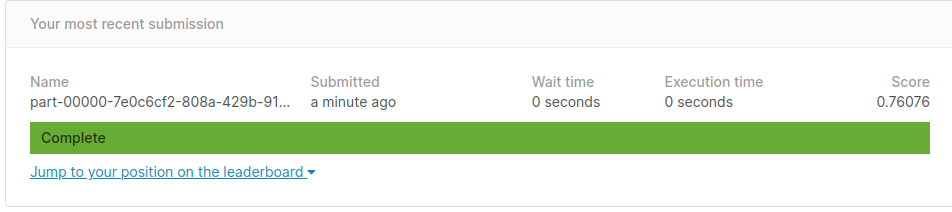

# Spark-Scala-Kaggles
Using scala spark to train models for kaggle competition.


## Requirement
- sbt
- spark 2.4.5
- make

## Usage
#### Build
```
make build
```
After build, it should have a jar file in the target/scala-2.11
#### Spark-submit
```
make submit
```
After submit, the prediction csv file will in **/tmp/submit**

## Note
If we want to try to make the model more accurate, there is a easy way which is add more hyperparameters in the search space.